# 🧊 Rubik's Cube Solver — Hybrid Korf IDA\* & Kociemba Two-Phase Algorithm

> **A high-performance, optimal Rubik's Cube solver implementing Richard Korf's IDA\* with Pattern Databases, Herbert Kociemba's Two-Phase Algorithm, and a real-time OpenGL 3D interactive simulator.**


---

## 📖 Table of Contents

1. [Project Overview](#-project-overview)
2. [Architecture & Project Structure](#-architecture--project-structure)
3. [Cube State Representation](#-cube-state-representation)
4. [Pattern Databases (PDBs)](#-pattern-databases-pdbs)
5. [Rank Calculation — Lehmer Coding](#-rank-calculation--lehmer-coding)
6. [Nibble Compression (4-Bit Storage)](#-nibble-compression-4-bit-storage)
7. [48-Way Symmetry Reduction](#-48-way-symmetry-reduction)
8. [Solver Algorithms](#-solver-algorithms)
9. [Move Pruning & Heuristic Combination](#-move-pruning--heuristic-combination)
10. [OpenGL Interactive Simulator](#-opengl-interactive-simulator)
11. [Build & Run Instructions](#-build--run-instructions)
12. [Performance Metrics](#-performance-metrics)
13. [References & Citations](#-references--citations)

---

## 🎯 Project Overview

This project solves the Rubik's Cube optimally (minimum number of moves) by combining two state-of-the-art algorithms:

| Algorithm | Role | Optimality | Speed |
|-----------|------|------------|-------|
| **Korf's IDA\*** | Optimal solver using Pattern Database heuristics | ✅ Proven optimal | ~seconds for ≤15 moves |
| **Kociemba's Two-Phase** | Divide-and-conquer into two subgroup searches | ⚠️ Near-optimal | Very fast |
| **Hybrid** | Phase 1 via Kociemba → Phase 2 via Korf | ✅ Phase 2 optimal | Best of both |

The **Hybrid Solver** uses Kociemba's Phase 1 to quickly reduce the cube to an intermediate group G₁, then employs Korf's IDA\* with pattern database heuristics to optimally solve the remainder.

### Key Technical Features

- **Cubie-level cube representation** — Dual arrays for 8 corners and 12 edges with position + orientation tracking
- **Four Pattern Databases** — Corner PDB (88M states), Edge Permutation PDB (239M states), two 7-Edge PDBs (2M states each)
- **Lehmer Code indexing** — O(n²) factorial number system ranking for bijective state → integer mapping
- **4-bit nibble compression** — Packs two distance values per byte, halving memory
- **48-way symmetry reduction** — Full octahedral group O_h reduces corner PDB by 48×
- **Multi-threaded BFS generation** — OpenMP-accelerated database construction
- **Parallel IDA\* search** — Root-level branch parallelism via OpenMP
- **Move pruning tables** — 18×18 precomputed validity matrix eliminates redundant move sequences
- **Real-time OpenGL 3.3 renderer** — Phong shading, procedural rounded cubies, SLERP animations, solution playback

---

## 🏗 Architecture & Project Structure

### Directory Layout

```
cube_solver/
├── CMakeLists.txt                    # Build system (CMake 3.15+, Ninja)
├── README.md                         # This document
├── include/                          # Header files (public API)
│   ├── cube/
│   │   ├── CubieCube.h               # Core cubie-level state representation
│   │   └── RubiksCube.h              # High-level cube interface + move history
│   ├── database/
│   │   ├── PatternDatabase.h         # PDB: BFS generation, nibble I/O, lookup
│   │   ├── RankCalculator.h          # Lehmer code + orientation ranking
│   │   └── SymmetryReduction.h       # 48-way octahedral symmetry transforms
│   ├── solver/
│   │   ├── Solver.h                  # Abstract solver + KorfSolver + SimpleIDDFS
│   │   ├── TwoPhase.h                # Kociemba Two-Phase IDA* (Phase 1 + Phase 2)
│   │   ├── HybridSolver.h            # Hybrid = Kociemba Phase 1 + Korf Phase 2
│   │   ├── HeuristicCombination.h    # MAX / Weighted / Additive / Korf heuristics
│   │   └── MovePruning.h             # 18×18 pruning table for redundant moves
│   ├── renderer/
│   │   ├── CubeRenderer.h            # OpenGL 3.3 renderer (Phong, SLERP, stickers)
│   │   └── InteractiveSolver.h       # Application controller (input, solve, animate)
│   └── utils/
│       ├── Constants.h               # Enums (Face, MoveType, CornerPos, EdgePos)
│       └── stb_easy_font.h           # Lightweight text rendering library
├── src/                              # Implementation files
│   ├── cube/
│   │   ├── CubieCube.cpp             # Move cycles, orientation updates, state queries
│   │   └── RubiksCube.cpp            # Move parsing, scramble, ranking delegation
│   ├── database/
│   │   ├── PatternDatabase.cpp       # BFS generator, nibble read/write, file I/O
│   │   ├── RankCalculator.cpp        # Lehmer code, base-N orientation, combined rank
│   │   └── SymmetryReduction.cpp     # Rotation X/Y/Z, reflection, canonical form
│   ├── solver/
│   │   ├── Solver.cpp                # KorfSolver IDA*, SimpleIDDFS, TwoPhaseAlgorithm
│   │   ├── TwoPhase.cpp              # G1 detection, Phase 1/2 IDA* search
│   │   ├── HybridSolver.cpp          # Two-Phase P1 → Korf P2 orchestration
│   │   ├── HeuristicCombination.cpp  # Multi-PDB combination strategies
│   │   └── MovePruning.cpp           # Pruning table lookup + move pair reduction
│   ├── renderer/
│   │   ├── CubeRenderer.cpp          # Geometry gen, Phong shaders, slice animation
│   │   └── InteractiveSolver.cpp     # Event loop, async solver, solution playback
│   ├── main.cpp                      # CLI test entry point
│   └── main_interactive.cpp          # Interactive GUI entry point
├── tests/
│   ├── cube_test.cpp                 # Unit tests for cube operations
│   └── rank_test.cpp                 # Unit tests for ranking functions
├── data/                             # Generated .pdb files stored here
└── build/                            # CMake build output
```

### Module Dependency Flow

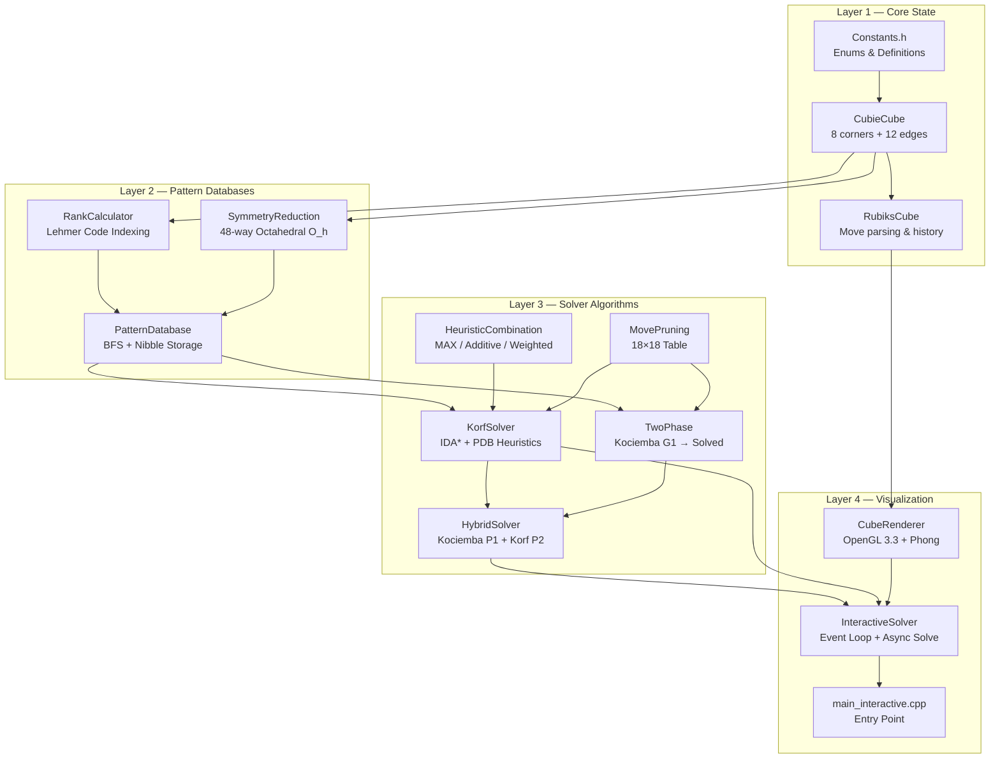

### End-to-End Execution Flow

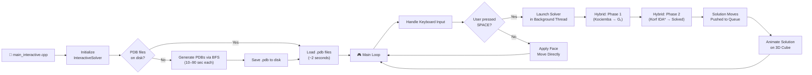

---

## 🎲 Cube State Representation

### Cubie Model

The Rubik's Cube is modeled at the **cubie level** — each physical piece is tracked individually:

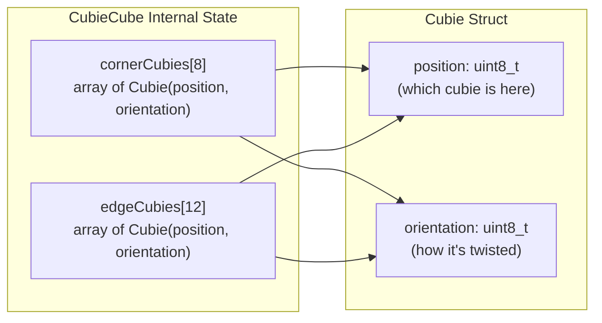

| Component | Count | Position Range | Orientation Range | Total States |
|-----------|-------|----------------|-------------------|--------------|
| **Corners** | 8 | 0–7 | 0–2 (120° twist) | 8! × 3⁷ = 88,179,840 |
| **Edges** | 12 | 0–11 | 0–1 (flip) | 12! × 2¹¹ ≈ 980 billion |
| **Total** | 20 pieces | — | — | ~4.3 × 10¹⁹ states |

### Corner Position Naming Convention

```
         ┌─────────┐
         │ ULB  URB│   (U face — White)
         │   U     │
         │ ULF  URF│
    ┌────┼─────────┼────┬─────────┐
    │ ULB│ ULF  URF│ URB│ ULB  URB│
    │  L │   F     │  R │   B     │
    │ DLB│ DLF  DRF│ DRB│ DLB  DRB│
    └────┼─────────┼────┴─────────┘
         │ DLF  DRF│   (D face — Yellow)
         │   D     │
         │ DLB  DRB│
         └─────────┘
```

### Move Mechanics

Each face rotation is a **4-cycle permutation** of both corners and edges:

| Face | Corner Cycle | Edge Cycle | Corner Orientation Change | Edge Orientation Change |
|------|-------------|------------|--------------------------|------------------------|
| **U** | ULB→URB→URF→ULF | UB→UR→UF→UL | None | None |
| **D** | DLB→DLF→DRF→DRB | DB→DL→DF→DR | None | None |
| **L** | ULB→ULF→DLF→DLB | UL→FL→DL→BL | +2, +1, +2, +1 (mod 3) | None |
| **R** | URB→DRB→DRF→URF | UR→BR→DR→FR | +1, +2, +1, +2 (mod 3) | None |
| **F** | ULF→URF→DRF→DLF | UF→FR→DF→FL | +2, +1, +1, +2 (mod 3) | All flip (XOR 1) |
| **B** | URB→ULB→DLB→DRB | UB→BL→DB→BR | +2, +1, +1, +2 (mod 3) | All flip (XOR 1) |

> **Key insight**: Only F and B moves change edge orientations. This is fundamental to the Two-Phase algorithm's G₁ detection.

---

## 📊 Pattern Databases (PDBs)

### What Are Pattern Databases?

A **Pattern Database** is a precomputed lookup table that maps every possible state of a *subset* of the cube's pieces to the **minimum number of moves** required to solve *just those pieces*. This value serves as an **admissible heuristic** for IDA\* — it never overestimates the true distance.

### Database Types

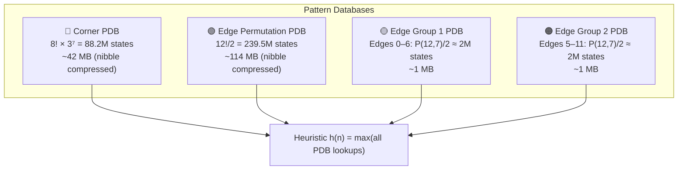

### BFS Generation Algorithm

Each database is generated by a **Breadth-First Search** from the solved state:

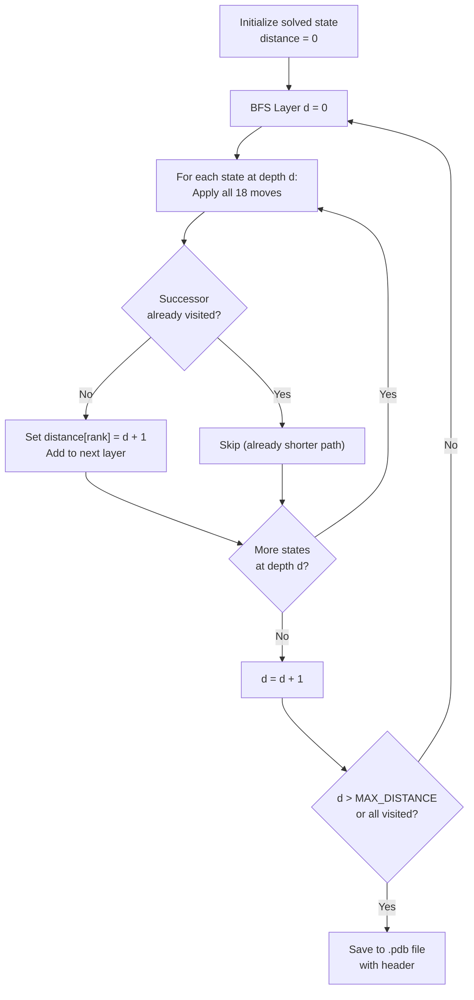

The generation uses **multi-threaded BFS** via OpenMP. Each thread maintains a local `next_layer` vector, and the results are merged after each depth level. An **atomic compare-and-swap** operation on nibble bytes ensures thread-safe concurrent writes without locks:

```cpp
// Atomic CAS on the byte containing the target nibble
auto* atomic_byte = reinterpret_cast<std::atomic<uint8_t>*>(&distances[byteIndex]);
uint8_t expected = atomic_byte->load(std::memory_order_relaxed);
while (true) {
    if (current_nibble != 0x0F) return false;  // Already visited
    if (atomic_byte->compare_exchange_weak(expected, desired)) return true;
}
```

---

## 🔢 Rank Calculation — Lehmer Coding

### The Problem

To store a distance value for each cube state, we need a **bijective mapping** from cube states to integers `[0, N)`. This is the **ranking problem**.

### Permutation Ranking via Lehmer Code

The **Lehmer code** (factorial number system) converts a permutation of `n` elements into a unique integer in `[0, n!)`:

```
Algorithm: For permutation P of size n
1. For each position i from 0 to n-1:
   a. Count inversions: how many elements P[j] < P[i] exist for j > i
   b. This count is the i-th digit in factorial base
2. Rank = Σ (digit[i] × (n-1-i)!)
```

**Example**: Rank the permutation `[2, 0, 1]`

| Position i | Value P[i] | Elements smaller to the right | Digit | Weight (n-1-i)! | Contribution |
|-----------|-----------|------------------------------|-------|----------------|-------------|
| 0 | 2 | {0, 1} → 2 | 2 | 2! = 2 | 4 |
| 1 | 0 | {} → 0 | 0 | 1! = 1 | 0 |
| 2 | 1 | {} → 0 | 0 | 0! = 1 | 0 |

**Rank = 4 + 0 + 0 = 4** ✓

### Orientation Ranking via Base-N Number

Corner orientations are encoded as a **base-3 number** (edges as base-2):

```
orientations = [o₀, o₁, o₂, ..., o₆]   (7 values, 8th is determined)
rank = o₀ × 3⁰ + o₁ × 3¹ + o₂ × 3² + ... + o₆ × 3⁶
```

**Key constraint**: The last orientation is redundant because:
- **Corners**: Σ orientations ≡ 0 (mod 3)
- **Edges**: XOR of all orientations = 0

This means we only store `n-1` orientations, giving us `3⁷ = 2,187` states for corners and `2⁷ = 128` for edge subsets.

### Combined Corner Rank

```
combined_rank = permutation_rank + orientation_rank × 8!
Range: [0, 40,320 × 2,187) = [0, 88,179,840)
```

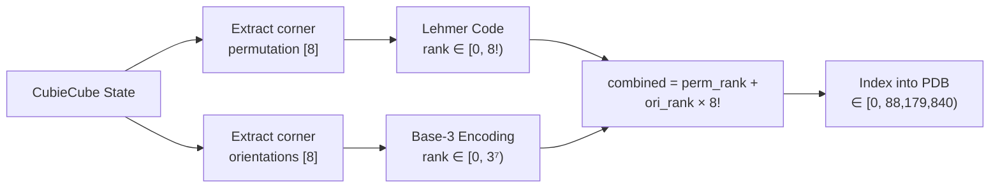

---

## 📦 Nibble Compression (4-Bit Storage)

### Why Nibbles?

Distance values in pattern databases range from 0 to 11 (at most). Since 11 < 16 = 2⁴, each distance fits in **4 bits** (one nibble). Packing two distances per byte **halves memory usage**:

```
Standard:  1 byte per distance  → 88M bytes = 84 MB
Nibble:    2 distances per byte → 44M bytes = 42 MB  (50% savings!)
```

### Storage Layout

```
Byte index:    [    0    ] [    1    ] [    2    ] ...
Bit layout:    [3210|7654] [3210|7654] [3210|7654]
Distance:      [even|odd ] [even|odd ] [even|odd ]

Index 0 → byte 0, lower nibble (bits 0–3)
Index 1 → byte 0, upper nibble (bits 4–7)
Index 2 → byte 1, lower nibble
Index 3 → byte 1, upper nibble
...
```

### Read/Write Operations

```cpp
// WRITE: Pack distance into nibble
void setDistanceNibble(uint64_t index, uint8_t distance) {
    uint64_t byteIndex = index / 2;
    bool isUpper = (index % 2) == 1;
    distance &= 0x0F;  // Ensure 4 bits max

    if (isUpper)
        distances[byteIndex] = (distances[byteIndex] & 0x0F) | (distance << 4);
    else
        distances[byteIndex] = (distances[byteIndex] & 0xF0) | distance;
}

// READ: Extract distance from nibble
uint8_t getDistanceNibble(uint64_t index) const {
    uint64_t byteIndex = index / 2;
    bool isUpper = (index % 2) == 1;
    return isUpper ? (distances[byteIndex] >> 4) & 0x0F
                   : distances[byteIndex] & 0x0F;
}
```

### File Format

Pattern databases are saved as binary files with a structured header:

```
┌──────────────────────────────────────────┐
│ PDBHeader (72 bytes, packed)             │
│  ├── version:        uint32 (must be 1)  │
│  ├── pdbType:        uint32              │
│  ├── numStates:      uint64              │
│  ├── dataSize:       uint64              │
│  ├── maxDistance:    uint32              │
│  ├── generationTime: uint32 (seconds)    │
│  └── reserved:       char[40]            │
├──────────────────────────────────────────┤
│ Nibble-Compressed Distance Data          │
│  (dataSize bytes)                        │
└──────────────────────────────────────────┘
```

---

## 🔄 48-Way Symmetry Reduction

### The Symmetry Group

The Rubik's Cube has **48 symmetries** — the full octahedral group O_h:
- **24 rotational symmetries** (identity, 6 face rotations, 8 vertex rotations, etc.)
- **24 improper rotations** (each rotation composed with a reflection)

Two cube states related by a symmetry have **identical minimum distances** to solved. Instead of storing all 88M corner states, we store only the **canonical representative** of each symmetry class:

```
88,179,840 states ÷ 48 ≈ 1,837,080 canonical states
Memory: 42 MB → ~0.9 MB  (48× reduction!)
```

### Canonical Form Selection

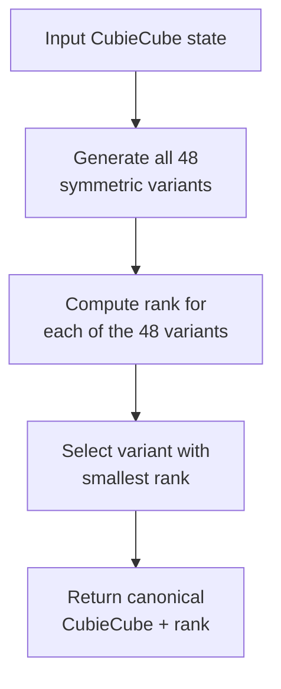

### Symmetry Generators

All 48 symmetries are generated by combining three base transformations:

| Generator | Operation | Face Mapping |
|-----------|-----------|-------------|
| **Rotate X** | 90° around R-axis | U→B, B→D, D→F, F→U |
| **Rotate Y** | 90° around U-axis | F→R, R→B, B→L, L→F |
| **Rotate Z** | 90° around F-axis | U→R, R→D, D→L, L→U |
| **Reflect LR** | Mirror L↔R | L↔R, others unchanged |

The 48 symmetries are generated by:
1. Moving each of 6 faces to the "Up" position (using X and Z rotations)
2. For each, rotating 4 times around Y
3. For each of the resulting 24, applying the LR reflection

---

## 🧠 Solver Algorithms

### Algorithm 1: Korf's IDA\* (Iterative-Deepening A\*)

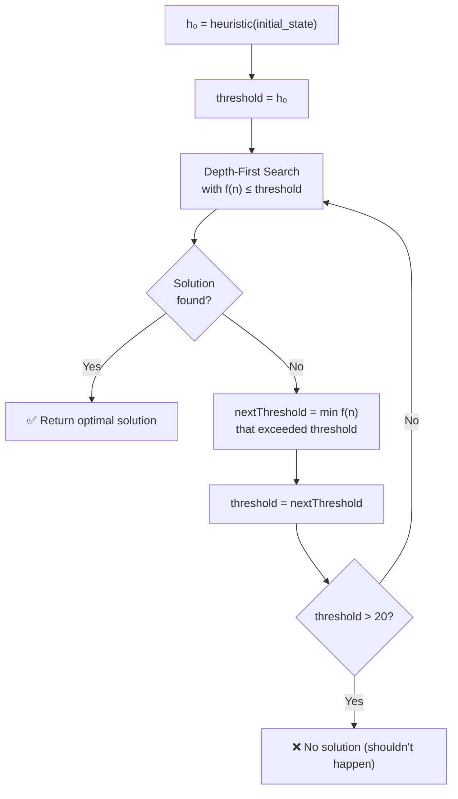

**IDA\* Properties:**
- **Admissible heuristic**: `h(n) = max(cornerPDB, edgePDB1, edgePDB2)` — never overestimates
- **Optimal**: Guaranteed to find shortest solution
- **Memory-efficient**: O(depth) stack space vs. O(branching^depth) for A\*
- **God's number**: Maximum solution length is proven to be 20 (HTM)

### Algorithm 2: Kociemba's Two-Phase Algorithm

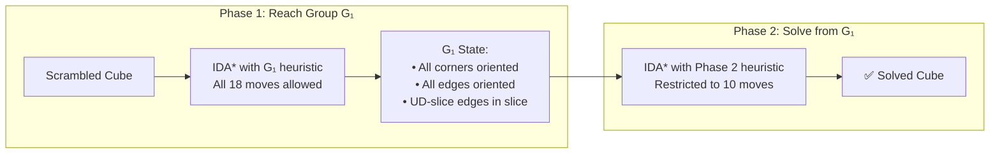

**G₁ Subgroup Conditions:**
1. All 8 corner orientations = 0 (no twist)
2. All 12 edge orientations = 0 (no flip)
3. UD-slice edges (FR, FL, BR, BL) are in positions 8–11

**Phase 2 Restricted Moves**: Only `{U, U', U2, D, D', D2, R2, L2, F2, B2}` — 10 moves total. This restriction ensures the G₁ properties are preserved.

### Algorithm 3: Hybrid Solver (Our Approach)

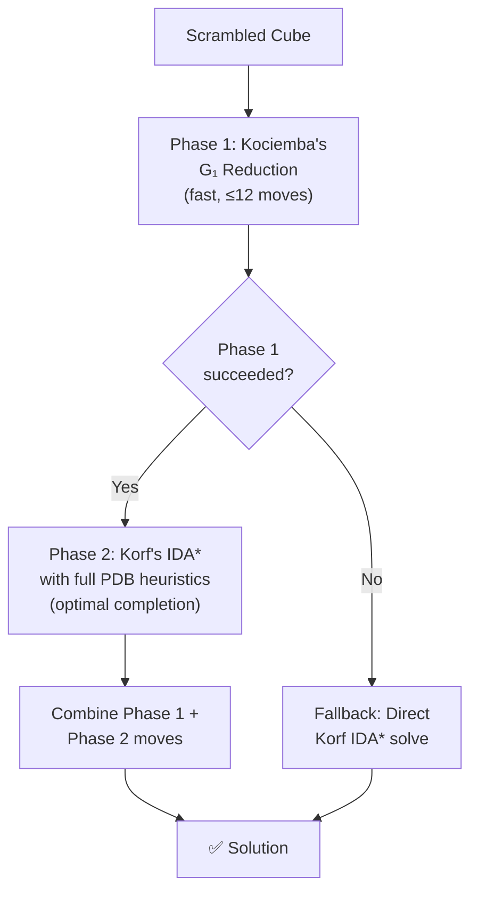

**Why Hybrid?** Korf's IDA\* can be slow for deeply scrambled cubes because the search tree grows exponentially. By using Kociemba's Phase 1 to quickly simplify the cube to G₁ (typically 6–10 moves), the remaining problem is much smaller, allowing Korf's IDA\* to solve it optimally in reasonable time.

---

## ✂️ Move Pruning & Heuristic Combination

### Move Pruning

The branching factor at each node is 18 (6 faces × 3 types). However, many sequences are **redundant**:

| Rule | Example | Why Redundant |
|------|---------|--------------|
| Same face | U followed by U' | Net effect = identity |
| Same face | U followed by U | Should be U2 directly |
| Opposite face ordering | D followed by U | Same as U followed by D (commutative) |

The **18×18 pruning table** eliminates these:

```
PRUNING_TABLE[prevMove][nextMove] = true/false
```

This reduces the effective branching factor from 18 to approximately **15**, providing significant speedup at deep search depths.

### Heuristic Combination Strategies

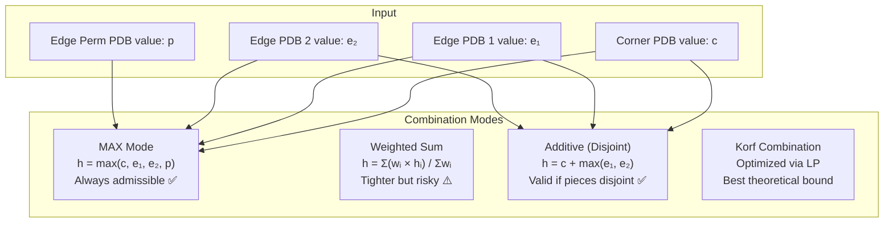

The solver defaults to **MAX mode** — it takes the maximum across all PDB lookups. This is always admissible (never overestimates) because each PDB provides a lower bound on the true distance.

---

## 🖥 OpenGL Interactive Simulator

### Renderer Architecture

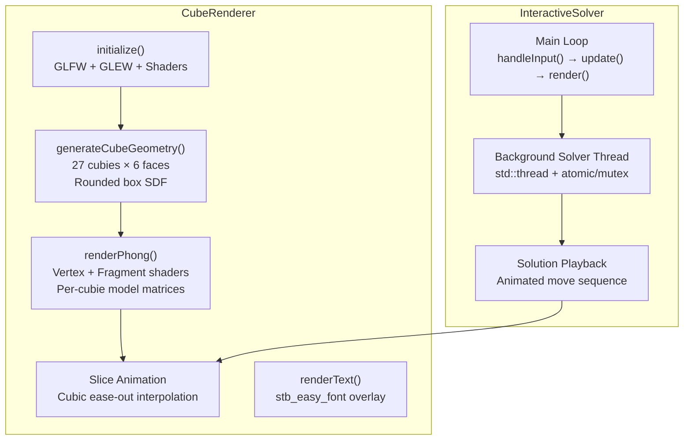

### Rendering Pipeline

**1. Geometry Generation**: 27 cubies, each with 6 faces. Each face is a parametric grid (16×16 resolution) with Signed Distance Function (SDF) rounding:

```glsl
float d = sdRoundBox(UV, vec2(0.85), 0.12);
float alpha = smoothstep(edge, -edge, d);
baseColor = mix(vec3(0.04), stickerColor, alpha);
```

**2. Phong Shading**: Ambient (0.45) + Diffuse (0.55) + Specular (sharp, shininess=64) with a soft directional light from the top-right-front.

**3. Slice Animation**: Each face rotation animates via **cubic ease-out** interpolation:

```cpp
float invT = 1.0f - t;
float easeT = 1.0f - (invT * invT * invT);  // Smooth deceleration
currentAngle = easeT * targetAngle;
```

**4. Cube Rotation**: Full-cube rotation uses **quaternion SLERP** (Spherical Linear Interpolation) with ease-in-out cubic for smooth, gimbal-lock-free orbiting.

### Keyboard Controls

| Key | Action |
|-----|--------|
| `U`, `D`, `L`, `R`, `F`, `B` | Clockwise face rotation |
| `Shift` + face key | Counter-clockwise (prime) rotation |
| `Ctrl` + face key | 180° (double) rotation |
| `SPACE` | Solve cube (background thread) |
| `S` | Scramble (7 random moves) |
| `G` | Reset to solved state |
| `1` / `2` / `3` | Select IDA\* / Hybrid / IDDFS solver |
| Mouse drag | Orbit camera |
| `ESC` | Exit |

---

## 🛠 Build & Run Instructions

### Prerequisites

- **C++17 compiler** (GCC 9+, Clang 10+, or MSVC 2019+)
- **CMake 3.15+**
- **Ninja** build system (recommended)
- **MSYS2 UCRT64** (Windows) or equivalent Linux toolchain
- **Libraries**: GLFW3, GLEW, GLM, OpenMP

#### Install dependencies (MSYS2 UCRT64)

```bash
pacman -S mingw-w64-ucrt-x86_64-cmake \
          mingw-w64-ucrt-x86_64-ninja \
          mingw-w64-ucrt-x86_64-glfw \
          mingw-w64-ucrt-x86_64-glew \
          mingw-w64-ucrt-x86_64-glm \
          mingw-w64-ucrt-x86_64-gcc
```

### Build Commands

```bash
# Navigate to project directory
cd /c/Users/User/OneDrive/Documents/cube_solver

# Clean and build
rm -rf build
mkdir build
cd build
cmake .. -G Ninja
cmake --build . --target solver_interactive
```

### Run — First Time (PDB Generation)

On first run, pattern databases will be generated (~1–5 minutes total):

```bash
./solver_interactive.exe
```

You will see progress output:

```
Generating pattern database type 0 using multi-threading...
  Allocated 42.10 MB
  Depth 1 complete. Visited 19 / 88179840 (0.00%) states.
  Depth 2 complete. Visited 262 / 88179840 (0.00%) states.
  ...
  Depth 11 complete. Visited 88179840 / 88179840 (100.00%) states.
  Generation complete!
Saving database to ./databases/corner.pdb...
```

### Run — Subsequent Times (PDB Loading)

Once databases exist on disk, loading takes ~2 seconds:

```bash
./solver_interactive.exe
```

```
Loading database from ./databases/corner.pdb... Loaded (42 MB)
Loading database from ./databases/edge1.pdb... Loaded (1 MB)
...
```

---

## 📈 Performance Metrics

| Metric | Value |
|--------|-------|
| **Corner PDB size** | 88,179,840 states → 42 MB (nibble) |
| **Edge Permutation PDB** | 239,500,800 states → 114 MB (nibble) |
| **Edge Group PDB (each)** | 1,995,840 states → ~1 MB (nibble) |
| **Total PDB memory** | ~158 MB |
| **PDB generation time** | 10–90 seconds per database (4 threads) |
| **PDB load from disk** | ~2 seconds total |
| **Solve time (7-move scramble)** | < 100 ms |
| **Solve time (15-move scramble)** | 1–30 seconds |
| **Branching factor (unpruned)** | 18 |
| **Branching factor (pruned)** | ~15 |
| **Symmetry reduction factor** | 48× for corner PDB |

---

## 📚 References & Citations

1. **Korf, R.E.** (1997). "Finding Optimal Solutions to Rubik's Cube Using Pattern Databases." *Proceedings of AAAI-97*, pp. 700–705.

2. **Korf, R.E. & Felner, A.** (2002). "Disjoint Pattern Database Heuristics." *Artificial Intelligence*, 134(1-2), pp. 9–22.

3. **Korf, R.E., Reid, M. & Edelkamp, S.** (2001). "Time Complexity of Iterative-Deepening-A\*." *Artificial Intelligence*, 129(1-2), pp. 199–218.

4. **Kociemba, H.** (1992). "Close to God's Algorithm." Cube-Lovers mailing list.

5. **Rokicki, T., Kociemba, H., Davidson, M. & Dethridge, J.** (2014). "The diameter of the Rubik's Cube group is twenty." *SIAM Review*, 56(4), pp. 645–670. (Proof that God's number = 20)

6. **Benbotto** (2019). *rubiks-cube-cracker* — Reference C++ implementation. GitHub.

7. **Lehmer, D.H.** (1960). "Teaching combinatorial tricks to a computer." *Proceedings of Symposia in Applied Mathematics*, 10, pp. 179–193. (Lehmer code for permutation ranking)

---